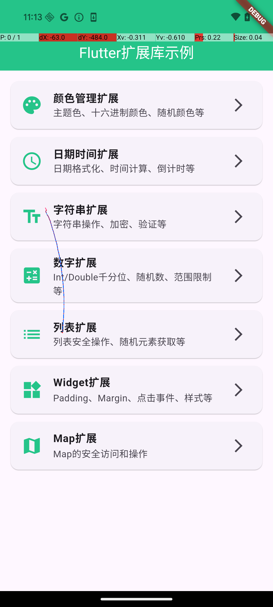
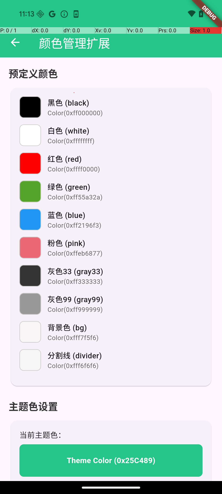
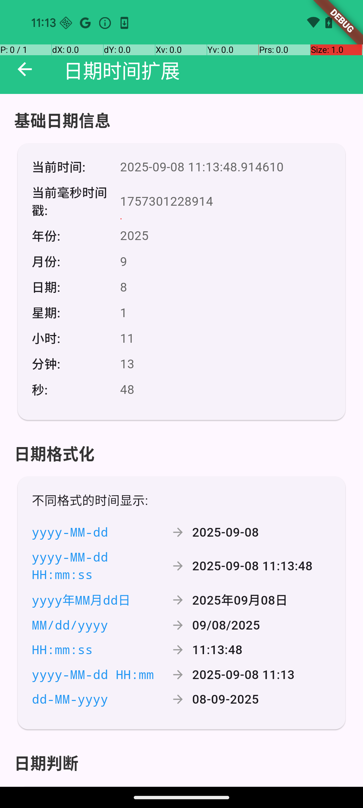

# Flutter Extension

<div align="center">


**🚀 一个功能强大的Flutter扩展工具库**

*提供颜色管理、日期处理、字符串操作、数字扩展、列表工具、Widget扩展和Map操作等丰富功能*

[📱 查看示例](#-示例项目) • [📚 文档](#-快速开始) • [🎯 功能](#-核心功能) • [🤝 贡献](#-贡献指南)

</div>

---

## 📱 示例项目

我们提供了一个完整的示例项目，展示了所有扩展功能的使用方法：

### 应用截图

<table>
<tr>
<td width="25%">
<h4 align="center">🏠 主页面</h4>

<p align="center"><em>功能模块导航</em></p>
</td>
<td width="25%">
<h4 align="center">🎨 颜色管理</h4>

<p align="center"><em>主题色、色彩转换</em></p>
</td>
<td width="25%">
<h4 align="center">📅 日期时间</h4>

<p align="center"><em>格式化、计算、判断</em></p>
</td>
<td width="25%">
<h4 align="center">🔤 字符串处理</h4>

<p align="center"><em>操作、加密、验证</em></p>
</td>
</tr>
</table>

### 运行示例项目

```bash
# 进入示例目录
cd example

# 安装依赖
flutter pub get

# 运行项目
flutter run
```

---

## 🚀 快速开始

### 安装

在 `pubspec.yaml` 中添加依赖：

```yaml
dependencies:
  flutter_extension:
    git:
      url: https://github.com/your-username/flutter_extension.git
```

或者使用本地路径：

```yaml
dependencies:
  flutter_extension:
    path: ../flutter_extension
```

### 导入

```dart
import 'package:flutter_extension/flutter_extension.dart';
```

### 基础使用

```dart
// 初始化颜色主题
ColorManager.init(0x25C489);

// 使用扩展功能
String formatted = "12345".thousands;        // "12,345"
Color themeColor = ColorManager.theme;       // 主题色
DateTime tomorrow = DateTime.now().nextDay;  // 明天
```

---

## 🎯 核心功能

### 🎨 颜色管理 (ColorManager)

强大的颜色管理工具，提供主题色、预定义颜色和颜色转换功能。

```dart
// 预定义颜色
ColorManager.red            // 红色
ColorManager.green          // 绿色  
ColorManager.blue           // 蓝色
ColorManager.theme          // 主题色

// 颜色转换
ColorManager.hex(0xFF5722)           // 十六进制转颜色
ColorManager.hexStr('#FF5722')       // 字符串转颜色
ColorManager.random                  // 随机颜色
ColorManager.transparent(alpha: 0.5) // 透明色

// 主题设置
ColorManager.init(0x25C489);         // 初始化主题色
```

**主要特性:**
- ✅ 20+ 预定义颜色常量
- ✅ 十六进制颜色转换
- ✅ 随机颜色生成
- ✅ 透明度颜色支持
- ✅ 动态主题色管理

---

### 📅 日期时间扩展 (DateOption)

全面的日期时间处理工具，支持格式化、计算和判断。

```dart
DateTime now = DateTime.now();

// 格式化
now.format(format: 'yyyy-MM-dd')     // "2024-01-01"
now.format(format: 'HH:mm:ss')       // "14:30:25"

// 判断
now.isToday                          // 是否今天
now.isYesterday                      // 是否昨天
now.isFirstDayOfMonth                // 是否月初

// 计算
now.firstDayOfMonth                  // 本月第一天
now.lastDayOfMonth                   // 本月最后一天
now.previousMonth                    // 上个月
now.nextMonth                        // 下个月

// 时间转换
DateOption.numToStringTime(3661)     // "01:01:01"
```

**主要特性:**
- ✅ 多种日期格式化
- ✅ 日期边界判断
- ✅ 月份/周次计算
- ✅ 倒计时格式转换
- ✅ 中文时间显示

---

### 🔤 字符串扩展 (StringOption)

丰富的字符串处理工具，包含验证、修改、加密等功能。

```dart
String? text = "Hello Flutter";

// 状态检查
text.isNull                          // 是否为null
text.isEmptyOrNull                   // 是否为null或空
text.isNotEmptyOrNull                // 是否有效字符串

// 字符串操作
text.addStart("Hi! ")                // 添加前缀
text.addEnd(" World")                // 添加后缀
text.deleteSub("Flutter")            // 删除子字符串
text.replaceSub("Hello", "Hi")       // 替换子字符串

// 查找功能
text.isContains("Flutter")           // 包含检查
text.isStart("Hello")                // 开头检查
text.isEnd("Extension")              // 结尾检查

// 加密功能
text.md5()                           // MD5加密
text.sha1()                          // SHA1加密
text.base64()                        // Base64编码

// 千分位
"12345".thousands                    // "12,345"

// 随机字符串
"".random(count: 8)                  // 生成8位随机字符串
```

**主要特性:**
- ✅ 空安全检查
- ✅ 字符串修改操作
- ✅ 多种加密算法
- ✅ 千分位格式化
- ✅ 枚举类型转换
- ✅ 随机字符串生成

---

### 🔢 数字扩展 (Int & Double)

便捷的数字处理扩展，支持格式化、随机数和范围控制。

```dart
// 整数扩展
int number = 12345;
number.thousands                     // "12,345"
number.random                        // 0到number之间的随机数
number.range(100, 0)                 // 限制在0-100范围内

// 浮点数扩展  
double decimal = 12345.67;
decimal.string()                     // 转为字符串
decimal.thousands                    // "12,345.67"
```

**主要特性:**
- ✅ 千分位分隔符
- ✅ 随机数生成
- ✅ 数值范围限制
- ✅ 类型转换
- ✅ 边界处理

---

### 📋 列表扩展 (ListOption)

安全的列表操作工具，提供空安全和边界检查。

```dart
List<String>? list = ['Apple', 'Banana', 'Cherry'];

// 状态检查
list.isNull                          // 是否为null
list.isEmptyOrNull                   // 是否为null或空
list.isNotEmptyOrNull                // 是否有效列表

// 安全访问
list.stItem(0)                       // 安全获取元素
list.stItem(999)                     // 越界返回null
list.random                          // 随机获取元素

// 安全修改
list.stInsert(1, 'Orange')           // 安全插入
list.stRemove(0)                     // 安全删除
list.stInsertStart('First')          // 插入到开头
list.stInsertEnd('Last')             // 插入到末尾
```

**主要特性:**
- ✅ 空安全检查
- ✅ 边界保护
- ✅ 随机元素获取
- ✅ 安全插入删除
- ✅ 越界处理

---

### 🎨 Widget扩展

强大的UI扩展工具，简化布局和样式设置。

```dart
Widget widget = Text('Hello World');

// Padding 扩展
widget.paddingAll(16)                // 四周16px内边距
widget.paddingSH(20)                 // 水平20px内边距  
widget.paddingSV(12)                 // 垂直12px内边距

// Margin 扩展
widget.marginAll(16)                 // 四周16px外边距

// 尺寸扩展
widget.sizeW(100)                    // 固定宽度100
widget.sizeH(50)                     // 固定高度50
20.0.boxW                            // 20px宽度间隔
10.0.boxH                            // 10px高度间隔

// 点击事件
widget.onTap(() => print('Tap'))     // 添加点击事件
widget.inkWell(() => print('Tap'))   // 水波纹点击

// 样式扩展
widget.color(Colors.blue)            // 背景色
widget.radius(8)                     // 圆角
widget.border(1, color: Colors.red)  // 边框

// 布局扩展
[widget1, widget2].row()             // 水平布局
[widget1, widget2].column()          // 垂直布局
widget.expand(flex: 2)               // Expanded包装

// 位置扩展
widget.position(left: 10, top: 20)   // 绝对定位
widget.offstage(true)                // 隐藏/显示
```

**主要特性:**
- ✅ 链式调用支持
- ✅ 内边距/外边距快捷设置
- ✅ 尺寸和间隔控制
- ✅ 点击事件简化
- ✅ 样式快速应用
- ✅ 布局辅助工具

---

### 🗂️ Map扩展 (MapOption)

安全的Map操作工具，避免空指针异常。

```dart
Map<String, dynamic> map = {'name': 'John', 'age': 25};

// 安全访问
map.value('name')                    // 安全获取值
map.value('nonexistent')             // 不存在返回null

// 设置操作
map.set(key: 'email', obj: 'john@example.com');  // 设置值
map.set(key: 'age', obj: null);                  // 删除键

// 添加操作
map.add('status', 'active');         // 添加或更新
```

**主要特性:**
- ✅ 空安全访问
- ✅ 智能添加/更新
- ✅ 自动边界处理
- ✅ 支持泛型类型

---

### 📝 日志扩展

便捷的调试日志工具。

```dart
// 字符串日志
"Hello World".log();                 // 输出到控制台

// 调试日志
stLog("Debug message");              // 带时间戳的日志
stLog("Error occurred", current: StackTrace.current);  // 带堆栈信息
```

**主要特性:**
- ✅ 时间戳显示
- ✅ 文件名和行号定位
- ✅ 堆栈跟踪支持
- ✅ 发布模式自动禁用

---

## 📦 完整功能列表

| 分类 | 功能 | 描述 |
|------|------|------|
| 🎨 **颜色管理** | ColorManager | 主题色、预定义颜色、颜色转换、随机颜色 |
| 📅 **日期时间** | DateOption | 格式化、计算、判断、倒计时转换 |
| 🔤 **字符串** | StringOption | 操作、验证、加密、千分位、枚举转换 |
| 🔢 **数字** | Int/Double Extension | 千分位、随机数、范围限制、类型转换 |
| 📋 **列表** | ListOption | 空安全、边界检查、随机元素、安全操作 |
| 🎨 **Widget** | Widget Extension | Padding、Margin、尺寸、样式、布局、事件 |
| 🗂️ **Map** | MapOption | 安全访问、智能更新、边界处理 |
| 📝 **日志** | Log Extension | 调试输出、堆栈跟踪、时间戳 |

---

## 📋 环境要求

- **Flutter SDK**: >= 1.17.0
- **Dart SDK**: >= 2.19.0
- **平台支持**: Android, iOS, macOS, Web

## 📖 依赖项

```yaml
dependencies:
  flutter:
    sdk: flutter
  intl: 0.18.1      # 国际化支持
  crypto: 3.0.1     # 加密功能
  convert: 3.0.1    # 类型转换
```

---

## 🎓 使用示例

### 基础示例

```dart
import 'package:flutter/material.dart';
import 'package:flutter_extension/flutter_extension.dart';

class MyApp extends StatelessWidget {
  @override
  Widget build(BuildContext context) {
    // 初始化主题色
    ColorManager.init(0x2196F3);
    
    return MaterialApp(
      title: 'Flutter Extension Demo',
      theme: ThemeData(primaryColor: ColorManager.theme),
      home: HomePage(),
    );
  }
}

class HomePage extends StatelessWidget {
  @override
  Widget build(BuildContext context) {
    final now = DateTime.now();
    final userList = ['张三', '李四', '王五'];
    
    return Scaffold(
      appBar: AppBar(
        title: Text('扩展功能演示'),
        backgroundColor: ColorManager.theme,
      ),
      body: [
        // 日期显示
        Container(
          child: Text(
            '今天是 ${now.format(format: 'yyyy年MM月dd日')}',
            style: TextStyle(fontSize: 18),
          ),
        ).paddingAll(16),
        
        // 用户列表
        ...userList.map((user) => ListTile(
          title: Text(user),
          subtitle: Text('随机ID: ${"".random(count: 6)}'),
          trailing: Icon(Icons.person),
        ).paddingSH(16)),
        
        // 数字展示
        Container(
          child: Text(
            '格式化数字: ${12345.thousands}',
            style: TextStyle(fontSize: 16),
          ),
        ).paddingAll(16).color(ColorManager.grayF6),
        
        // 按钮
        ElevatedButton(
          onPressed: () {
            '按钮被点击了！'.log();
          },
          child: Text('点击测试'),
        ).paddingAll(16),
        
      ].column(caa: CrossAxisAlignment.start),
    );
  }
}
```

---

## 📁 项目结构

```
flutter_extension/
├── 📂 lib/
│   ├── 🎯 flutter_extension.dart        # 主入口文件
│   └── 📂 src/                          # 源代码目录
│       ├── 🎨 color_extension.dart      # 颜色管理扩展
│       ├── 📅 date_extension.dart       # 日期时间扩展
│       ├── 🔤 string_extension.dart     # 字符串扩展
│       ├── 🔢 int_extension.dart        # 整数扩展
│       ├── 🔢 double_extension.dart     # 浮点数扩展
│       ├── 📋 list_extension.dart       # 列表扩展
│       ├── 🎨 widget_extension.dart     # Widget扩展
│       ├── 🗂️ map_extension.dart        # Map扩展
│       ├── 📝 log_extension.dart        # 日志扩展
│       └── 🔗 ad_extension.dart         # 统一导出
├── 📱 example/                          # 示例项目
├── 🧪 test/                            # 测试文件
├── 📋 pubspec.yaml                      # 项目配置
├── 📖 README.md                         # 项目说明
├── 📄 LICENSE                           # 开源协议
└── 📝 CHANGELOG.md                      # 更新日志
```

---

## 🤝 贡献指南

我们欢迎社区贡献！请遵循以下步骤：

### 提交Issue

- 🐛 **Bug报告**: 使用Issue模板描述问题
- 💡 **功能请求**: 详细说明新功能的用途和实现方案
- 📖 **文档改进**: 指出文档中的错误或需要改进的地方

### 提交代码

1. **Fork项目**
2. **创建分支**: `git checkout -b feature/amazing-feature`
3. **编写代码**: 遵循Dart代码规范
4. **提交更改**: `git commit -m 'Add some amazing feature'`
5. **推送分支**: `git push origin feature/amazing-feature`
6. **创建Pull Request**

---

## 📊 性能与兼容性

### 性能特点

- ⚡ **轻量级**: 无额外依赖，包大小小于50KB
- 🚀 **高效率**: 扩展方法直接调用，无性能损耗
- 🛡️ **空安全**: 所有方法都经过空安全检查
- 🔄 **延迟加载**: 按需初始化，减少启动时间

### 兼容性

| 平台 | 支持版本 | 状态 |
|------|----------|------|
| 📱 Android | API 16+ | ✅ 完全支持 |
| 🍎 iOS | iOS 9.0+ | ✅ 完全支持 |
| 💻 macOS | macOS 10.14+ | ✅ 完全支持 |
| 🌐 Web | Chrome 84+ | ✅ 完全支持 |

---

## 📈 版本历史

### 最新版本 v1.0.0

- ✨ 初始版本发布
- 🎨 颜色管理功能
- 📅 日期时间扩展
- 🔤 字符串处理工具
- 🔢 数字扩展功能
- 📋 列表安全操作
- 🎨 Widget UI扩展
- 🗂️ Map操作工具
- 📝 日志记录功能

---

## 📄 许可证

本项目基于 [MIT License](LICENSE) 开源。

---

<div align="center">

**🎉 感谢使用 Flutter Extension！**

*如果这个项目对您有帮助，请给个 ⭐️ Star 支持一下*

Made with ❤️ by Flutter Extension Team

</div>
