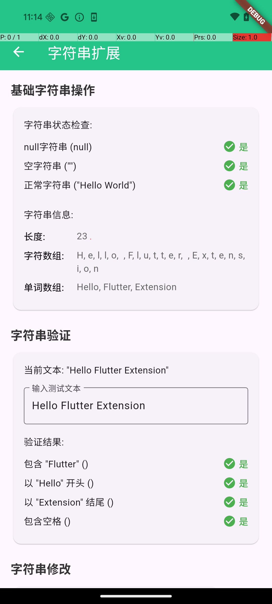

# Flutter Extension 示例项目

<div align="center">


**一个展示 Flutter Extension 插件所有功能的完整示例项目**

*涵盖颜色管理、日期处理、字符串操作、数字扩展、列表工具、Widget 扩展和 Map 操作等多个维度*

</div>

---

## 📱 应用截图

### 主页面


*主页面展示了所有扩展功能模块，每个模块都有清晰的图标和说明*

### 核心功能演示

<table>
<tr>
<td width="50%">
<h4>🎨 颜色管理扩展</h4>

<p><em>预定义颜色、主题色设置、十六进制转换、随机颜色等</em></p>
</td>
<td width="50%">
<h4>📅 日期时间扩展</h4>

<p><em>日期格式化、时间计算、倒计时、日期判断等</em></p>
</td>
</tr>
<tr>
<td width="50%">
<h4>🔤 字符串扩展</h4>

<p><em>字符串操作、加密、验证、千分位、枚举转换等</em></p>
</td>
<td width="50%">
<h4>🎨 Widget扩展</h4>

<p><em>Padding、Margin、点击事件、样式、布局等UI扩展</em></p>
</td>
</tr>
</table>

---

## 🚀 快速开始

### 环境要求

- **Flutter SDK**: >= 1.17.0
- **Dart SDK**: >= 2.19.0
- **平台支持**: Android, iOS, macOS, Web

### 安装运行

```bash
# 1. 克隆项目
git clone <your-repo-url>
cd extension/example

# 2. 安装依赖
flutter pub get

# 3. 运行项目
flutter run

# 或指定平台运行
flutter run -d android    # Android
flutter run -d ios        # iOS  
flutter run -d macos      # macOS
flutter run -d chrome     # Web
```

---

## 🎯 核心功能详解

### 🎨 颜色管理扩展 (ColorManager)

提供强大的颜色管理功能，支持主题色、预定义颜色和动态颜色生成。

```dart
// 🎨 预定义颜色
ColorManager.theme          // 主题色
ColorManager.red            // 红色
ColorManager.green          // 绿色
ColorManager.blue           // 蓝色

// 🔧 十六进制颜色
ColorManager.hex(0xFF5722)           // 创建颜色
ColorManager.hexStr('#FF5722')       // 字符串转颜色

// 🎲 随机颜色
ColorManager.random                  // 生成随机颜色

// 🌫️ 透明度颜色
ColorManager.transparent(alpha: 0.5) // 半透明黑色

// ⚙️ 主题初始化
ColorManager.init(0x25C489);         // 设置主题色
```

**✨ 主要特性:**
- 20+ 预定义颜色常量
- 十六进制颜色转换
- 随机颜色生成
- 透明度颜色支持
- 动态主题色切换

---

### 📅 日期时间扩展 (DateOption)

强大的日期时间处理工具，涵盖格式化、计算和判断等功能。

```dart
DateTime now = DateTime.now();

// 📝 格式化
now.format(format: 'yyyy-MM-dd')     // "2024-01-01"
now.format(format: 'HH:mm:ss')       // "14:30:25"
now.format(format: 'yyyy年MM月dd日')  // "2024年01月01日"

// ✅ 判断
now.isToday                          // 是否今天
now.isYesterday                      // 是否昨天
now.isFirstDayOfMonth                // 是否月初
now.isLastDayOfMonth                 // 是否月末

// 🧮 计算
now.firstDayOfMonth                  // 本月第一天
now.lastDayOfMonth                   // 本月最后一天
now.previousMonth                    // 上个月
now.nextMonth                        // 下个月
now.previousWeek                     // 上一周
now.nextWeek                         // 下一周

// ⏱️ 时间转换
DateOption.numToStringTime(3661)     // "01:01:01"
DateOption.numToStringTimeByDayHourMinute(90061)  // "1天1小時1分鐘"
```

**✨ 主要特性:**
- 多种日期格式化选项
- 日期边界判断
- 月份/周次计算
- 倒计时格式转换
- 中文时间显示

---

### 🔤 字符串扩展 (StringOption)

全面的字符串处理工具集，包含验证、修改、加密等功能。

```dart
String? text = "Hello Flutter Extension";

// ✅ 状态检查
text.isNull                          // 是否为null
text.isEmptyOrNull                   // 是否为null或空
text.isNotEmptyOrNull                // 是否有效字符串

// ✂️ 字符串操作
text.addStart("🎉 ")                 // 添加前缀
text.addEnd(" 🚀")                   // 添加后缀
text.deleteSub("Flutter")            // 删除子字符串
text.replaceSub("Hello", "Hi")       // 替换子字符串
text.sub(0, end: 5)                  // 截取子字符串

// 🔍 查找功能
text.isContains("Flutter")           // 包含检查
text.isStart("Hello")                // 开头检查
text.isEnd("Extension")              // 结尾检查

// 🔐 加密功能
text.md5()                           // MD5加密
text.sha1()                          // SHA1加密
text.base64()                        // Base64编码

// 💰 千分位
"12345".thousands                    // "12,345"
"12345.67".thousands                 // "12,345.67"

// 🎲 随机字符串
"".random(count: 8)                  // 生成8位随机字符串

// 🏷️ 枚举转换
"apple".toEnum(MyEnum.values)        // 字符串转枚举
```

**✨ 主要特性:**
- 空安全检查
- 字符串修改操作
- 多种加密算法
- 千分位格式化
- 枚举类型转换
- 随机字符串生成

---

### 🔢 数字扩展 (Int & Double)

便捷的数字处理扩展，支持格式化、随机数和范围控制。

```dart
// 🔢 整数扩展
int number = 12345;
number.thousands                     // "12,345" - 千分位格式
number.random                        // 0到number之间的随机数
number.range(100, 0)                 // 限制在0-100范围内

// 💫 浮点数扩展  
double decimal = 12345.67;
decimal.string()                     // 转为字符串
decimal.thousands                    // "12,345.67" - 千分位格式

// 🎯 实用示例
1000000.thousands                    // "1,000,000"
100.random                           // 0-99的随机数
150.range(100, 0)                    // 返回100（限制上限）
-10.range(100, 0)                    // 返回0（限制下限）
```

**✨ 主要特性:**
- 千分位分隔符
- 随机数生成
- 数值范围限制
- 类型转换
- 边界处理

---

### 📋 列表扩展 (ListOption)

安全的列表操作工具，提供空安全和边界检查。

```dart
List<String>? list = ['Apple', 'Banana', 'Cherry'];

// ✅ 状态检查
list.isNull                          // 是否为null
list.isEmptyOrNull                   // 是否为null或空
list.isNotEmptyOrNull                // 是否有效列表

// 🎯 安全访问
list.stItem(0)                       // 安全获取元素，越界返回null
list.stItem(999)                     // 返回null而不崩溃
list.random                          // 随机获取元素

// ✏️ 安全修改
list.stInsert(1, 'Orange')           // 安全插入，失败返回false
list.stRemove(0)                     // 安全删除，越界自动忽略
list.stInsertStart('First')          // 插入到开头
list.stInsertEnd('Last')             // 插入到末尾

// 🎲 实用功能
list.random                          // 随机获取元素
emptyList.random                     // 返回null（安全）
nullList.stItem(0)                   // 返回null（安全）
```

**✨ 主要特性:**
- 空安全检查
- 边界保护
- 随机元素获取
- 安全插入删除
- 越界处理

---

### 🎨 Widget扩展

强大的UI扩展工具，简化布局和样式设置。

```dart
Widget widget = Text('Hello World');

// 📏 Padding 扩展
widget.paddingAll(16)                // 四周16px内边距
widget.paddingSH(20)                 // 水平20px内边距  
widget.paddingSV(12)                 // 垂直12px内边距
widget.paddingTop(8)                 // 顶部8px内边距

// 📐 Margin 扩展
widget.marginAll(16)                 // 四周16px外边距
widget.margin(EdgeInsets.only(left: 24))  // 自定义外边距

// 📱 尺寸扩展
widget.sizeW(100)                    // 固定宽度100
widget.sizeH(50)                     // 固定高度50
widget.size(size: Size(200, 100))    // 自定义尺寸
20.0.boxW                            // 20px宽度间隔
10.0.boxH                            // 10px高度间隔

// 👆 点击事件
widget.onTap(() => print('Clicked')) // 添加点击事件
widget.inkWell(() => print('Tap'))   // 水波纹点击效果

// 🎨 样式扩展
widget.color(Colors.blue)            // 背景色
widget.radius(8)                     // 8px圆角
widget.border(1, color: Colors.red)  // 1px红色边框

// 📐 布局扩展
[widget1, widget2].row()             // 水平布局
[widget1, widget2].column()          // 垂直布局
widget.expand(flex: 2)               // Expanded包装

// 📍 位置扩展
widget.position(left: 10, top: 20)   // 绝对定位
widget.offstage(true)                // 隐藏/显示控制
```

**✨ 主要特性:**
- 链式调用支持
- 内边距/外边距快捷设置
- 尺寸和间隔控制
- 点击事件简化
- 样式快速应用
- 布局辅助工具

---

### 🗂️ Map扩展 (MapOption)

安全的Map操作工具，避免空指针异常。

```dart
Map<String, dynamic> userMap = {
  'name': 'John Doe',
  'age': 25,
  'email': 'john@example.com'
};

// 🔍 安全访问
userMap.value('name')                // 安全获取值，不存在返回null
userMap.value('nonexistent')         // 返回null而不抛异常

// ✏️ 设置操作
userMap.set(key: 'phone', obj: '123456789');     // 设置新值
userMap.set(key: 'email', obj: 'new@email.com'); // 更新现有值
userMap.set(key: 'age', obj: null);              // 删除键（obj为null）

// ➕ 添加操作
userMap.add('status', 'active');     // 添加新键或更新现有键
userMap.add('score', 95);            // 智能添加/更新

// 🛡️ 边界处理
userMap.set(key: null, obj: 'test'); // key为null时自动忽略
emptyMap.value('any')                // 安全访问空Map
```

**✨ 主要特性:**
- 空安全访问
- 智能添加/更新
- 自动边界处理
- 支持泛型类型
- 链式操作

---

## 🏗️ 项目结构

```
extension/example/
├── 📱 lib/
│   ├── 🎯 main.dart                    # 应用入口和主页面
│   └── 📂 pages/                       # 演示页面
│       ├── 🎨 color_demo_page.dart     # 颜色扩展演示
│       ├── 📅 date_demo_page.dart      # 日期扩展演示  
│       ├── 🔤 string_demo_page.dart    # 字符串扩展演示
│       ├── 🔢 number_demo_page.dart    # 数字扩展演示
│       ├── 📋 list_demo_page.dart      # 列表扩展演示
│       ├── 🎨 widget_demo_page.dart    # Widget扩展演示
│       └── 🗂️ map_demo_page.dart       # Map扩展演示
├── 📸 screenshots/                     # 应用截图
├── 🔧 pubspec.yaml                     # 项目配置
└── 📖 README.md                        # 项目说明
```

---

## ✨ 项目特色

### 🎯 **全面覆盖**
- ✅ 涵盖插件的所有扩展功能
- ✅ 每个功能都有详细的使用示例
- ✅ 包含边界情况和错误处理演示

### 🔄 **实时交互**
- ✅ 用户可以输入参数实时查看效果
- ✅ 动态演示功能特性
- ✅ 即时反馈和结果展示

### 🎨 **现代化界面**
- ✅ Material Design 设计规范
- ✅ 响应式布局适配
- ✅ 清晰的视觉层级和用户体验

### 📚 **完整文档**
- ✅ 详细的功能说明
- ✅ 代码示例和最佳实践
- ✅ 多维度使用场景展示

---

## 🎓 学习路径

### 1️⃣ **快速上手**
- 从主页开始浏览所有功能模块
- 了解插件提供的核心能力

### 2️⃣ **深入探索**
- 点击每个模块进入详细演示页面
- 查看具体的使用方法和效果

### 3️⃣ **动手实践**
- 在演示页面中输入不同参数
- 观察功能的实时变化和响应

### 4️⃣ **代码学习**
- 查看示例页面的源代码实现
- 了解最佳实践和使用技巧

### 5️⃣ **项目应用**
- 将学到的扩展方法应用到实际项目
- 享受更高效的开发体验

---

## 🛠️ 开发说明

### 依赖配置

```yaml
dependencies:
  flutter:
    sdk: flutter
  flutter_extension:
    path: ../                 # 引用本地插件
  cupertino_icons: ^1.0.8
```

### 导入使用

```dart
import 'package:flutter_extension/flutter_extension.dart';

// 现在可以使用所有扩展功能
ColorManager.init(0x25C489);      // 初始化主题色
String result = "12345".thousands; // 使用千分位扩展
```

### 热重载支持

项目完全支持Flutter热重载，开发过程中可以：
- `r` - 热重载 🔥
- `R` - 热重启
- `q` - 退出应用

---

## 🔧 常见问题

### Q: 如何添加新的演示功能？
A: 在对应的演示页面中添加新的Widget，参考现有的代码结构。

### Q: 如何修改主题色？
A: 在`main.dart`中修改`ColorManager.init()`的参数值。

### Q: 如何在自己的项目中使用这些扩展？
A: 将`flutter_extension`插件添加到项目依赖中，然后导入使用。

### Q: 应用运行出现错误怎么办？
A: 检查Flutter环境配置，运行`flutter doctor`检查环境状态。

---

## 📚 相关资源

- 🔗 [Flutter 官方文档](https://flutter.dev/docs)
- 🔗 [Dart 扩展方法文档](https://dart.dev/guides/language/extension-methods)
- 🔗 [Material Design 指南](https://material.io/design)
- 🔗 [Flutter 社区](https://flutter.dev/community)

---

## 🤝 贡献指南

欢迎提交Issue和Pull Request来改进项目：

1. Fork 项目
2. 创建功能分支 (`git checkout -b feature/AmazingFeature`)
3. 提交更改 (`git commit -m 'Add some AmazingFeature'`)
4. 推送到分支 (`git push origin feature/AmazingFeature`)
5. 开启 Pull Request

---

## 📄 许可证

本项目基于 MIT 许可证开源 - 查看 [LICENSE](../LICENSE) 文件了解详情。

---

<div align="center">

**🎉 感谢使用 Flutter Extension 示例项目！**

*如果这个项目对您有帮助，请给个 ⭐️ Star 支持一下*

Made with ❤️ by Flutter Extension Team

</div>